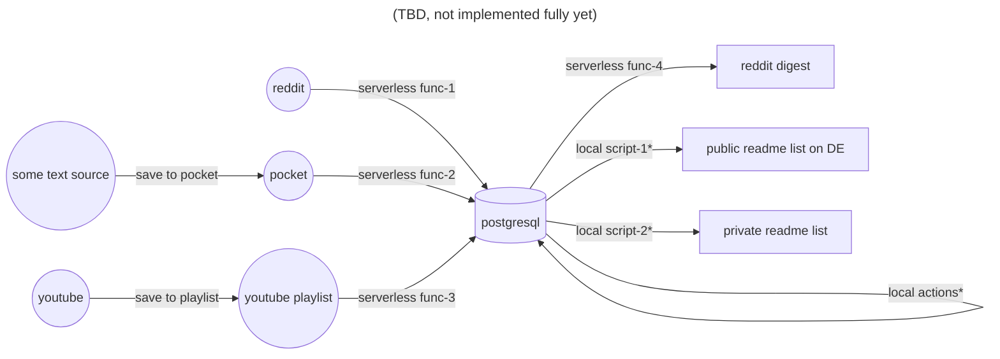

## Data flow map (read/watch)
Chart representing my way of working with incoming information sources

notes:
- local actions - all the kinds of actions useful to make tables more consistent, add the necessary tags, read marks, material quality marks, comments, deduplication, etc.
- local script-1/2 - as not all of my personal marks should be publicly available, there is some difference, but overall the scripts are quite similar: they both create an md view file on the same set of tables. the public readme is posted here in the repository. since both of views require some manual work, the scripts are applied locally, the cloud backend is not needed
- reddit digest - the project is not published yet (but some of its parts can be found in the same repository), does not involve any human control, should work completely autonomously, so the scripts are hosted in the cloud
