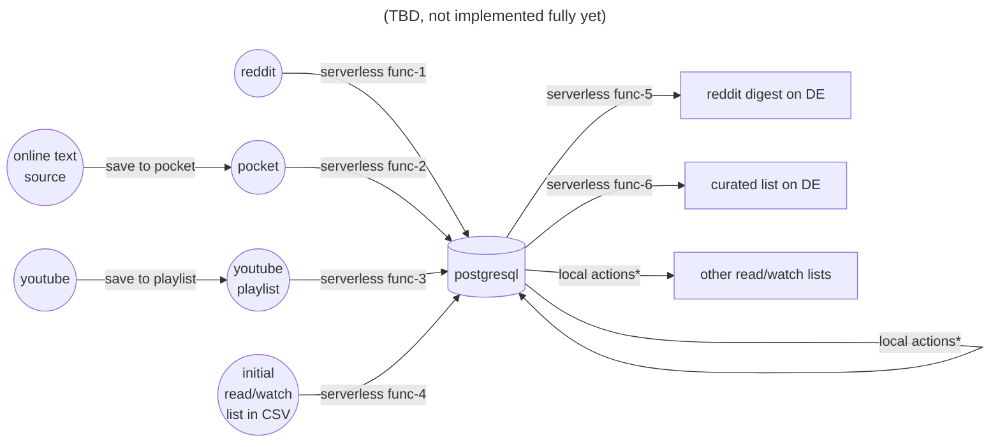

## Data flow map (read/watch)
Chart representing my way of working with incoming information sources

notes:
- local actions - all the kinds of actions useful to make tables more consistent, add the necessary tags, read marks, material quality marks, comments, deduplication, etc.
- reddit digest - not published yet, does not involve any human control, should work completely autonomously, scripts are stored here in the same repo and hosted in the cloud
